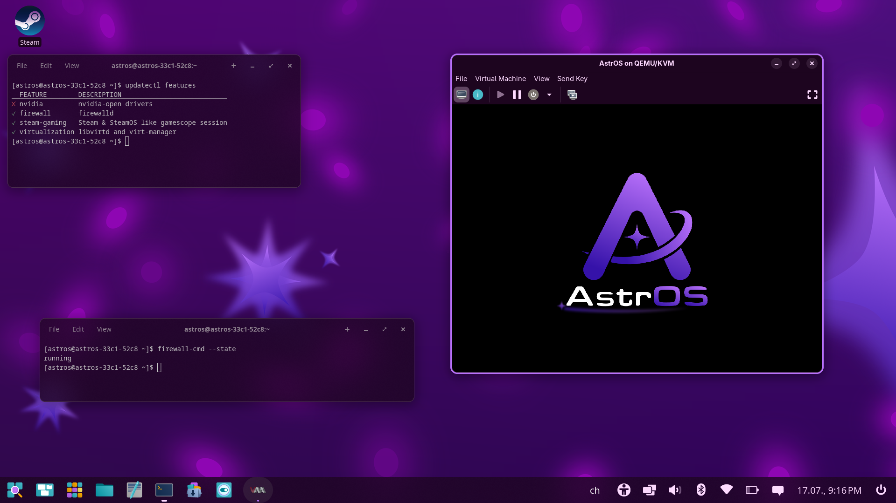

I‘m happy to announce that we got our first four system extensions.

- **Steam:** this was our first extension introducing system-wide installed Steam and the gamescope session from the Steam Deck we all know and love.

- **Firewall:** while this may get baked into the base image in the future, it is now possible to enable firewalld including a gui to configure it.

- **Virtualization:** libvirtd & virt-manager. We don’t want to be another immutable distro not supporting a proper vm tool allowing gpu / USB passthrough, etc.

- **Nvidia:** we now offer Nvidia drivers as a system extension. While I couldn’t test it myself due to me not owning any Nvidia GPU, this was reported as working.

But what are system extensions and why do they exist? System Extensions are our answer for programs that can’t easily be installed using flatpak or distrobox. While we want to keep our base unbloated and minimal, this allows us to deliver packages needing deeper system access to the users who need it.

How do I install them?

[Take a look at our docs](/astros/installing-software/#system-extensions)
