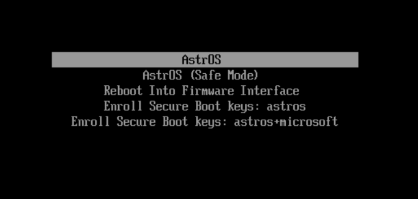

From the beginning, AstrOS has shipped its own custom Secure Boot keys.

Until now, every device that wanted Secure Boot was required to enroll only our custom keys in the firmware. This prevented the use of Secure Boot on devices whose option ROMs were signed by Microsoft. As a result, many devices were unable to use Secure Boot with AstrOS at all. This has changed.

We now ship two prepared key sets under `/boot/loader/keys/`.

`astros`: just as before, containing only our certificates and nothing else.

`astros+microsoft`: containing our certificate plus Microsoft's certificates added to `KEK` and `db` alongside ours.

Note that this doesn't mean our boot chain is now signed by Microsoft. It only allows the firmware to boot Microsoft-signed software / option ROMs.

The user can choose which to enroll when booting from Setup Mode.

Learn more on our [Secure Boot](/astros/secure-boot) page.
