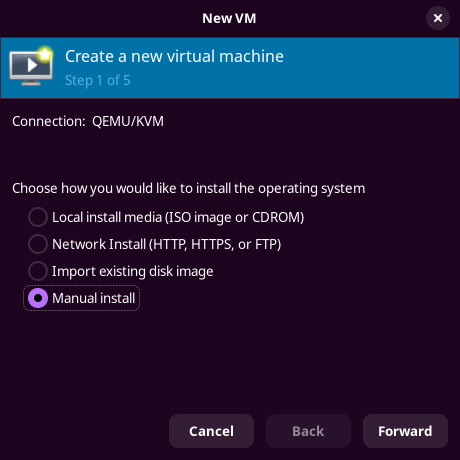
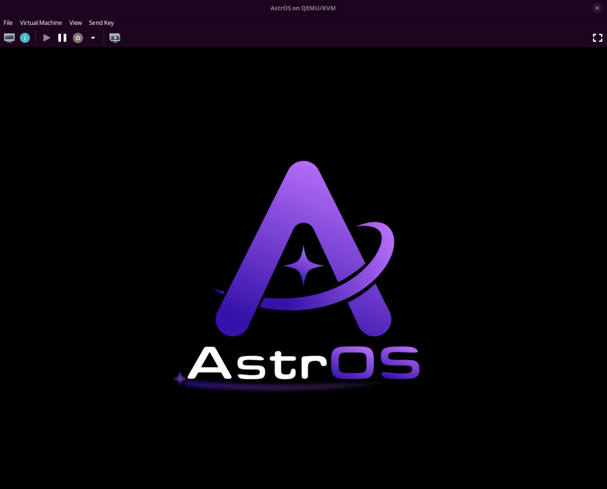

import { Steps } from '@astrojs/starlight/components';
import { Aside } from '@astrojs/starlight/components';

## Prerequisites

<Aside type="caution">GNOME Boxes is not officially supported due to the lack of simple TPM 2 support.</Aside>

<Aside>If you want to install AstrOS or other operating systems inside AstrOS,
you can skip this step and enable the `Virtualization`
[system extension](/astros/installing-software/#system-extensions).</Aside>

**In short:** you need a virtualization environment that supports UEFI and TPM 2.0.

We recommend using [qemu](https://www.qemu.org/), [libvirt](https://libvirt.org/) and [virt-manager](https://virt-manager.org/) and will use them for this guide.

Especially important are `edk2-ovmf` for UEFI support and `swtpm` for TPM support.
Depending on your distribution, they may be dependencies of the previously mentioned packages.

We found that using the [virt-manager flatpak](https://flathub.org/de/apps/org.virt_manager.virt-manager) with the [QEMU extension](https://github.com/flathub/org.virt_manager.virt_manager.Extension.Qemu) was the easiest way to install
the whole virtualization stack.

## Installation

<Steps>

1. [Download](https://dl.astros-linux.org/AstrOS-installer_latest_x86-64.raw.zst) and decompress AstrOS:

   ```sh
   unzstd AstrOS-installer_latest_x86-64.raw.zst
   ```

2. Create a new machine and select `Manual install`:

   

3. Complete the setup by selecting **Arch** as the distribution, allocating
sufficient memory and CPUs, creating a virtual disk image with **at least 30 GB of
Storage**, and most importantly, **ticking the `Customise configuration before
install` box.**

4. In the `Overview` section, change BIOS to UEFI firmware.

5. Click `Add Hardware`, navigate to `storage`, tick `Select or create custom storage` and search for the AstrOS install image.

6. Click on `Add Hardware` again and add a TPM device.

7. Recommended: Enable 3D acceleration.

8. You can now start the installation by clicking on `Begin Installation` in the top left.

   

</Steps>
