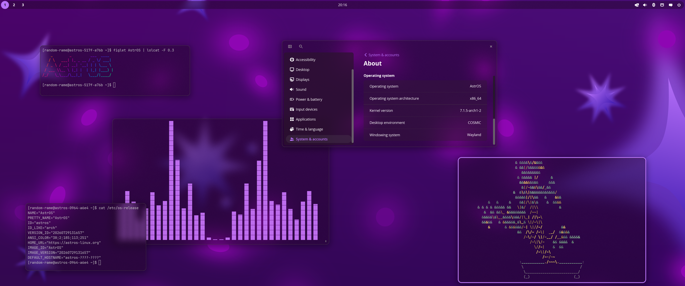

import { Image } from 'astro:assets';
import { Card, CardGrid } from '@astrojs/starlight/components';
import { LinkButton } from '@astrojs/starlight/components';

## Why AstrOS?

<CardGrid stagger>
 <Card title="Immutable base" icon="padlock">
  `/usr` ships as a signed, read-only dm-verity image. The base system can't be
  altered — not by you, not by anything else.
 </Card>
 <Card title="A/B updates" icon="random">
  `systemd-sysupdate` fetches and applies signed image updates atomically, keeping
  the previous version around for rollback.
 </Card>
 <Card title="Verified boot" icon="approve-check-circle">
  Unified Kernel Images are signed and measured, sealed against your TPM chip
  (PCR11). Secure Boot is supported.
 </Card>
 <Card title="Full-disk encryption" icon="seti:lock">
  The btrfs root holding `/home` and `/var` is encrypted and unlocked
  automatically via TPM2.
 </Card>
 <Card title="COSMIC desktop" icon="laptop">
  The modern Rust-based desktop from System76, tightly integrated
 </Card>
 <Card title="Container ready" icon="seti:docker">
  Install GUI-Apps using `flatpak` and use `distrobox` for running
  terminal or non flatpak supported software. [System extensions](/astros/installing-software/#system-extensions)
  for nvidia drivers or other system packages.
 </Card>
 <Card title="Optional Gaming Mode" icon="desktop">
  Enabling the [extension](/astros/gaming) adds a Steam Gamescope session on top of your system. Select it at
  login for a console-style experience, or configure [autologin](/astros/gaming/#auto-login-into-gaming-mode) to boot straight into it.
 </Card>
</CardGrid>

## Is it for you?

AstrOS is a strongly opinionated project. It's for people who want a secure,
encrypted, signed operating system that just works with minimal effort.

<CardGrid>
 <Card title="A good fit if" icon="approve-check">
  - You want verified boot and full-disk encryption without configuring any of it
  - You're happy with Flatpak, Distrobox, and system extensions
  - You are a gamer that wants a steamos like gaming mode
 </Card>
 <Card title="Look elsewhere if" icon="error">
  - Your hardware has no TPM 2.0 or UEFI
  - You want to hand-modify files under `/usr`
 </Card>
</CardGrid>

## Get involved

Questions, bug reports, and patches are all welcome.

<LinkButton href="https://discord.gg/f38pGadC2a" icon="discord" iconPlacement="start" variant="secondary">
 Discord
</LinkButton>
<LinkButton href="https://matrix.to/#/%23general:astros-linux.org" icon="matrix" iconPlacement="start" variant="secondary">
 Matrix
</LinkButton>
<LinkButton href="https://www.reddit.com/r/AstrOS_Linux" icon="reddit" iconPlacement="start" variant="secondary">
 Reddit
</LinkButton>
<LinkButton href="https://github.com/astros-linux/AstrOS" icon="github" iconPlacement="start" variant="secondary">
 GitHub
</LinkButton>
